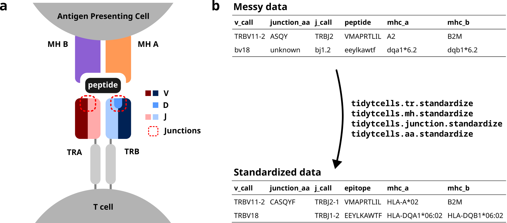

.. tidytcells documentation master file, created by
   sphinx-quickstart on Sun Nov  6 16:32:10 2022.
   You can adapt this file completely to your liking, but it should at least
   contain the root `toctree` directive.

tidytcells: Standardise TR/MH/IG data
=====================================

   **a)** A diagram of a T cell receptor (TR) interacting with a peptide-Major Histocompatibility (MH) complex.
   The V, D and J minigenes comprising each TR chain are shown by color.
   The red dotted lines point out the junction sequences of both TR chains.
   **b)** An illustration of how :py:mod:`tidytcells` can help clean TR data.
   By using :py:mod:`tidytcells`, non-standard nomenclature in the "messy data" is corrected, and any invalid values are filtered out.

:py:mod:`tidytcells` is a lightweight python package that cleans and standardizes T cell receptor (TR), Major Histocompatibility Complex (MH), and Immunoglobulin (IG) data to be IMGT-compliant (`IMGT/GENE-DB <https://www.imgt.org/genedb/>`_, `IMGT Repertoire <https://www.imgt.org/IMGTrepertoire/>`_).
The main purpose of the package is to solve the problem of parsing and collating together non-standardized TR datasets.
It is often difficult to compile TR data from multiple sources because the formats/nomenclature of how each dataset encodes TR and MH gene names are slightly different, or even inconsistent within themselves.
:py:mod:`tidytcells` can ameliorate this issue by auto-correcting and auto-standardizing your data!

.. tip::
  
  The :py:mod:`tidytcells.ig` submodule is newly added! It provides functionality for standardizing, querying, and retrieving amino acid sequences for immunoglobulin genes/alleles, similar to the existing TR and MH modules. Thanks to `Lonneke <https://github.com/LonnekeScheffer>`_ for implementing this module!

Contents
--------

.. toctree::
   :maxdepth: 2
   
   installation
   usage
   api
   citing
   contribute

Indices and tables
==================

* :ref:`genindex`
* :ref:`modindex`
* :ref:`search`